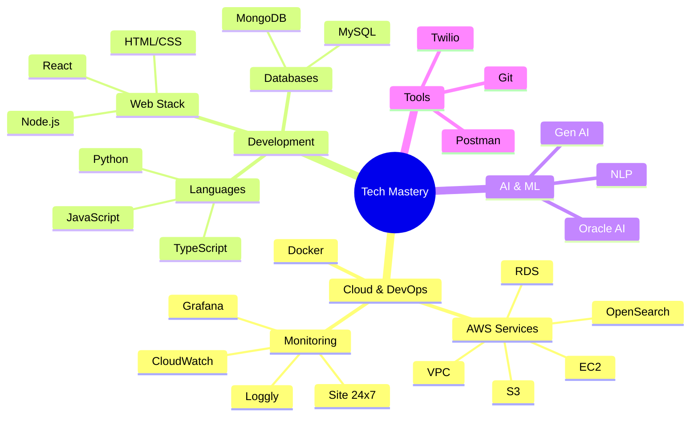

<h1 align="center">🏎️Pratap Pawar | Cloud Architect in the Making ☁️</h1>

<p align="center">
  
</p>

<div align="center">
  
</div>

## About Me
Site Reliability Engineer passionate about cloud technologies and building scalable systems. Currently working with AWS services and monitoring tools to enhance system reliability. I love contributing to open source and building tools that make a difference!🤍 <br>
I am also a final-year Computer Science student with a deep interest in cloud engineering, web development, and game development.🍅

### Tech Arsenal </>


### 🏆Accolades & Hackathon Achievements
<table style="width:100%; border: none;">
  <tr>
    <td align="center" style="width: 25%;">
      <b>ATMECS Global - GEN AI Hackathon</b><br>
      🤖 <b>National Finalist</b><br>
      <sub>Top 12 of 4900+ Teams (2024)</sub>
    </td>
    <td align="center" style="width: 25%;">
      <b>Rakuten - Rakathon 2024</b><br>
      🚀 <b>Grand Finalist</b><br>
      <sub>Top 100 of 8900+ Teams (2024)</sub>
    </td>
    <td align="center" style="width: 25%;">
      <b>GE Healthcare - Precision Care Challenge</b><br>
      ⚕️ <b>National Finalist</b><br>
      <sub>Top 12 of 900+ Teams (2024)</sub>
    </td>
    <td align="center" style="width: 25%;">
      <b>Smart India Hackathon - AICTE</b><br>
      🏅 <b>National Finalist</b><br>
      <sub>Top 6 of 500+ Teams (2023)</sub>
    </td>
  </tr>
  <tr>
    <td align="center" style="width: 25%;">
      <b>Mojaloop Foundation</b><br>
      💫 <b>DMP'24 Contributor</b><br>
      <sub>INR 1 Lakh Grant Secured (2024)</sub>
    </td>
    <td align="center" style="width: 25%;">
      <b>Central Pollution Control Board</b><br>
      🌱 <b>National Finalist</b><br>
      <sub>Top 5 Teams - Trash to Treasure (2023)</sub>
    </td>
    <td align="center" style="width: 25%;">
      <b>Google Crowdsource</b><br>
      🎯 <b>Vocalize Campaign</b><br>
      <sub>Top Contributor (2022)</sub>
    </td>
    <td align="center" style="width: 25%;">
      <b>VIT UnPlugged Hackathon</b><br>
      ⚡ <b>Grand Finalist</b><br>
      <sub>Top 11 of 110+ Teams (2023)</sub>
    </td>
  </tr>
  <tr>
    <td align="center" colspan="2" style="width: 50%;">
      <b>L&T TECHgium 7.0</b><br>
      🛠️ <b>Pre-Grand Finale</b><br>
      <sub>Top 175 of 4400+ Teams (Dec 2023)</sub>
    </td>
    <td align="center" colspan="2" style="width: 50%;">
      <b>Open Source Contributor</b><br>
      🌟 <b>Code for GovTech Program</b><br>
      <sub>Financial Inclusion Technologies (2024)</sub>
    </td>
  </tr>
  <tr>
    <td align="center" colspan="4" style="width: 100%;">
      <b>Code Hack 2023</b><br>
      🎪 <b>Event Organizer</b><br>
      <sub>1200+ Participants</sub>
    </td>
  </tr>
</table>


### ⚒️Featured Projects
<div style="text-align: center;">
  <table style="width:100%; border-collapse: collapse; text-align: center;">
    <tr style="border-bottom: 2px solid #ddd;">
      <td style="padding: 20px;">
        <h4>🎤 AAWAZ (SIH'23 Finalist)</h4>
        <p>Multilingual IVRS & Kiosk system for Indian Railways supporting 8 languages. Top 6/500 teams in SIH 2023.</p>
      </td>
      <td style="padding: 20px;">
        <h4>🔒 GPT-Locker</h4>
        <p>Chrome Extension for organizational data privacy in ChatGPT interactions. Tracks activity logs for data protection.</p>
      </td>
      <td style="padding: 20px;">
        <h4>🌐 TechNexus</h4>
        <p>Global technical events aggregator. Open-source platform with 45+ contributors, maintained during Hacktoberfest 2023-24.</p>
      </td>
    </tr>
  </table>
</div>

### 🎯Current Focus
- 🔭 Working on AWS infrastructure and monitoring ☁️
- 🌱 Exploring **Site Reliability Engineering** & **Cloud Native Technologies**
- 👨‍💻 Building **[Technexus](https://github.com/pawarspeaks/TechNexus)**
- 💡 Growing **[Dev Code Community](https://github.com/Dev-Code-Community)** with 5000+ technical enthusiasts!
- 🚀 Passionate about **Cloud & DevOps ☁️ | Full Stack Development 👨🏻‍💻 | Gen AI & NLP 🤖 | Game Dev 🎮 | Open Source 💫**
- 🔗 All of my projects are available at [https://github.com/pawarspeaks](https://github.com/pawarspeaks)
- 💁🏻‍♂ Find more about me at **[Pratap's Portfolio](https://pratappawar.vercel.app/)**
- 📧 Reach out to me at **[iampratappawar@gmail.com](mailto:iampratappawar@gmail.com)**

<div style="text-align: center;">
  <table style="width:100%; border: none;">
    <tr style="text-align: center; vertical-align: middle;">
      <td style="border: none; color: green;">
        <span>I might either be building </span>
      </td>
      <td style="border: none;">
        
      </td>
      <td style="border: none; color: green;">
        <span>or catching some Zzz's</span>
      </td>
      <td style="border: none;">
        
      </td>
    </tr>
  </table>
</div>


### 📈GitHub Metrics
<div style="display: flex; justify-content: center; gap: 20px; flex-wrap: wrap;">
  
  
  <a href="https://github.com/anuraghazra/github-readme-stats">
    
  </a>
</div>

<p style="text-align: center;">
  
</p>

	

### 😉Fun Mode
```javascript
const pratap = {
  status: "Debugging production while coffee debugging me ☕",
  currentlyLearning: ["Advanced AWS Architecture", "Kubernetes", "System Design"],
  askMeAbout: ["Cloud", "DevOps", "Community Building", "Hackathons"],
  certifications: ["AWS Cloud Practitioner", "GCP Digital Leader", "Oracle AI Pro"],
  funFact: "I can debug your system faster than I can debug my life! 😅"
};
```

<h3 align="left">🛠Languages and Tools:</h3>
<p align="center">
  <!-- Cloud & DevOps -->
  <a href="https://aws.amazon.com" target="_blank" rel="noreferrer">
    
  </a>
  <a href="https://docker.com" target="_blank" rel="noreferrer">
    
  </a>
  <a href="https://git-scm.com/" target="_blank" rel="noreferrer">
    
  </a>
  
  <!-- Programming Languages -->
  <a href="https://www.python.org" target="_blank" rel="noreferrer">
    
  </a>
  <a href="https://developer.mozilla.org/en-US/docs/Web/JavaScript" target="_blank" rel="noreferrer">
    
  </a>
  <a href="https://www.typescriptlang.org/" target="_blank" rel="noreferrer">
    
  </a>
  
  <!-- Web Development -->
  <a href="https://reactjs.org/" target="_blank" rel="noreferrer">
    
  </a>
  <a href="https://nodejs.org" target="_blank" rel="noreferrer">
    
  </a>
  <a href="https://www.w3.org/html/" target="_blank" rel="noreferrer">
    
  </a>
  <a href="https://www.w3schools.com/css/" target="_blank" rel="noreferrer">
    
  </a>
  
  <!-- Databases -->
  <a href="https://www.mongodb.com/" target="_blank" rel="noreferrer">
    
  </a>
  <a href="https://www.mysql.com/" target="_blank" rel="noreferrer">
    
  </a>
  
  <!-- Tools -->
  <a href="https://postman.com" target="_blank" rel="noreferrer">
    
  </a>
  <a href="https://firebase.google.com/" target="_blank" rel="noreferrer">
    
  </a>
  <a href="https://www.figma.com/" target="_blank" rel="noreferrer">
    
  </a>
  <a href="https://unrealengine.com/" target="_blank" rel="noreferrer">
    
  </a>
</p>


### 🫱🏻‍🫲🏻Let's Connect!
<div align="center">
  <a href="https://linkedin.com/in/pratappawar"></a>
  <a href="https://twitter.com/Pratappawar_"></a>
  <a href="https://instagram.com/pawarspeaks"></a>
  <a href="mailto:thepratappawar@gmail.com"></a>
  <a href="https://pratappawar.vercel.app/"></a>
</div>

### ©️Certifications
<div align="center">
  
  
  
</div>


<p align="center">⚡ Remember: "The best error message is the one that never shows up!" ⚡</p>

--------------------------------------------------------------------------------------------------------------------------------------------------------------------------------------------------------------

<p align="center">
  
</p>
